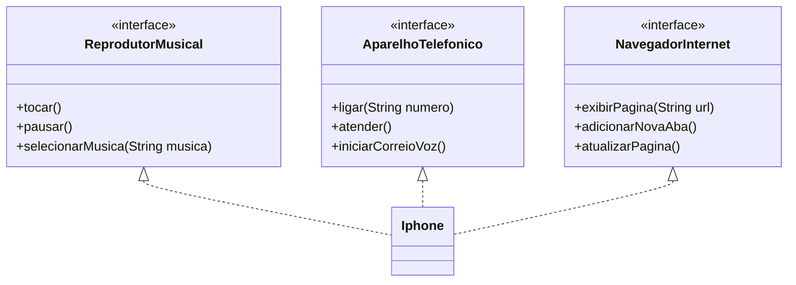

# Desafio De Projeto DIO - BackEnd Em Java
Resolução do desafio de projeto sobre modelagem e diagramação de um componente iPhone, conforme as funcionalidades descritas no enunciado do exercício.
Contém uma representação em diagrama de classes e uma em Java.

## Diagrama UML

